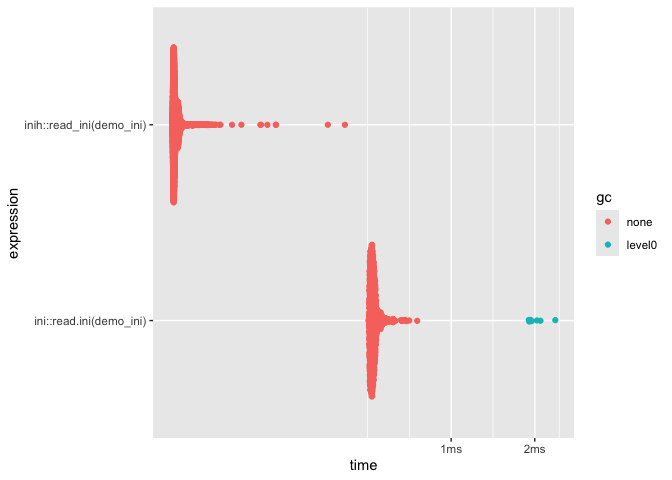

# inih

<!-- badges: start -->

[](https://CRAN.R-project.org/package=inih)
[](https://app.codecov.io/gh/DyfanJones/inih)
<!-- badges: end -->

A simple wrapper of the [`inih`](https://github.com/benhoyt/inih) C
library for reading and writing INI files in R.

## Installation

You can install the development version of inih like so:

``` r
remotes::install_github("dyfanjones/inih")
```

## Example

This is a basic example which shows you how to solve a common problem:

``` r
library(inih)

demo_ini <- system.file("demo.ini", package = "inih")
read_ini(demo_ini)
#> $job
#> $job$company
#> [1] "ExampleCorp"
#> 
#> $job$title
#> [1] "Engineer"
#> 
#> 
#> $person
#> $person$age
#> [1] "30"
#> 
#> $person$city
#> [1] "New York"
#> 
#> $person$name
#> [1] "John Doe"
#> 
#> $person$userId
#> [1] "123456"
```

``` r
library(inih)

temp_file <- tempfile(fileext = ".ini")
# Create an example configuration list
config <- list(
  person = list(name = "John Doe", age = "30", city = "New York"),
  job = list(title = "Engineer", company = "ExampleCorp")
)

# Write the configuration to an INI file
write_ini(config, temp_file)

# Check the content of the created INI file
cat(readLines(temp_file), sep = "\n")
#> [job]
#> company = ExampleCorp
#> title = Engineer
#> 
#> [person]
#> age = 30
#> city = New York
#> name = John Doe

# clean up
unlink(temp_file)
```

## Benchmark:

``` r
demo_ini <- system.file("demo.ini", package = "inih")
(bm <- bench::mark(
 inih::read_ini(demo_ini),
 ini::read.ini(demo_ini),
 relative = TRUE
))
#> # A tibble: 2 × 6
#>   expression                 min median `itr/sec` mem_alloc `gc/sec`
#>   <bch:expr>               <dbl>  <dbl>     <dbl>     <dbl>    <dbl>
#> 1 inih::read_ini(demo_ini)  1      1         5.11       NaN      NaN
#> 2 ini::read.ini(demo_ini)   5.10   5.18      1          Inf      Inf

ggplot2::autoplot(bm)
#> Loading required namespace: tidyr
```



## Acknowledgements

This project uses the [`inih`](https://github.com/benhoyt/inih) library
by Ben Hoyt, which is licensed under the BSD-3-Clause license. You can
find the license text in the `inst/LICENSE-inih.txt` file.
